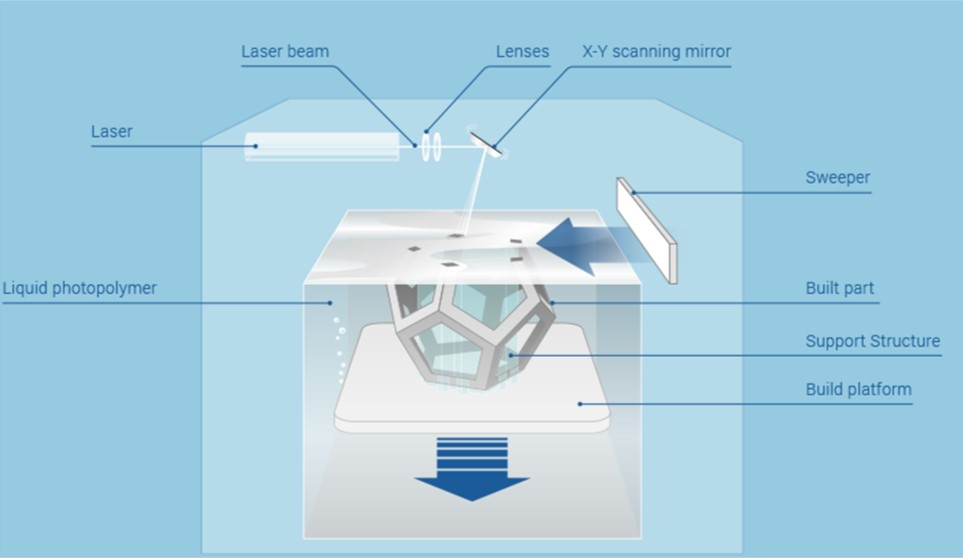

## Introduction
* Stereolithography (SLA or SL) is one of the first techniques which were developed in the domain of 3D printing.
* It was developed by Chuck Hull in 1984. Hull defined stereolithography as a method and apparatus for making solid objects by successively printing thin layers of the ultraviolet curable material one on top of the other.
* Hull developed a system where a photopolymer solution contained in a vat was solidified following exposure to a light source which traced the shape of the object. The beam is focused onto the surface of the liquid photopolymer, creating each layer of the desired 3D object by means of cross linking (generation of intermolecular bonds in polymers).
* In simple words, SLA is a laser-based process that works with photopolymer resins, that react with the laser and cure to form a solid in a very precise way to produce very accurate parts. 
* The information regarding the shape of the object which is to be printed is stored in form of CAD file. CAD file is converted to .stl format which stores the data about the surface of the object. Then this .stl file is fed to printer software which slices the 3D model into thin layers in X-Y planes which are laid down progressively one over the other in Z direction. 

## Principle
* SLA process is based on the principle that when photo-sensitive polymer resins are subjected to UV light, they get polymerised and eventually gets hardend. So, in SLA process such photo-polymer or photomer resins are treated with controlled UV light to fabricate the pre-defined shape. 

## Description
SLA process setup consists of a vat which is filled with photo-sensitive polymer resin, a laser beam and mirror apparatus and an elevating platform. This platform remains submerged in the liquid resin just below the surface film of the liquid resin. When resin is exposed to UV light it starts to polymerise. Mirror controlled lasers are used as a source of the UV light. When a laser beam is projected towards the surface on the liquid resin it traces the first layer on the resin surface and makes the first layer cured which is supported by the platform. Platform then traverses slightly downward so that further layers can be traced and generated. This process is repeated for each layer of the design until the 3D object is complete. Completed parts must be washed with a solvent to clean wet resin off their surfaces. 

 

## Materials for SLA 
* Photopolymer resins are used in SLA process.
* There are many types of liquid photopolymers that can be solidified by exposure to electro-magnetic radiation, including wavelengths in the gamma rays, X-rays, UV and visible range, or electron-beam (EB).
* UV-curable photopolymers are resins which are formulated from photo initiators and reactive liquid monomers. 
* The process through which photopolymers are cured is referred to as the photopolymerization process.
* Some commercially available resins are Accura SLA, RenShape SLA, Accura 55 with ABS, Accura 60 with polycarbonate, RenShape resins and many more.

## Key Application Areas
* Patterns for metal processing (e.g., blow molding, investment casting, thermoforming, etc.).
* Prototypes for demonstration and research purposes.
* Small batch production of complex geometric shapes.
* High-resolution micro and nano fabrication methods (e.g.,NEMS-Nano Electromechanical System & MEMS-Micro Electromechanical System).

## Advantages
* Fast process with less chances of errors.
* High resolution and good suraface finish.
* No need for support material.
* Photosensitive polymers have justifiable mechanical properties.

## Disadvantages
* Expensive equipment ($100-$500K approx.).
* Expensive materials (photosensitive resins are ~$100-200 /kg).
* Requires post-processing & post-curing.